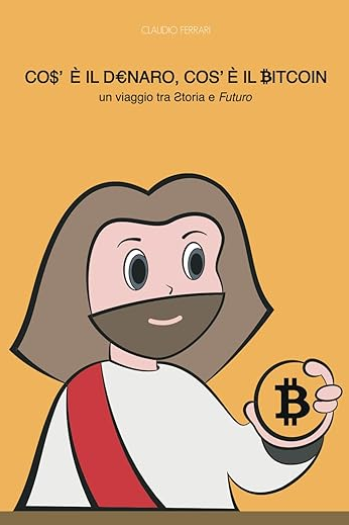

| TITOLO          | [Cos'è il denaro, cos'è il bitcoin](https://www.amazon.it/dp/B0CDBGM1L7) |
|:---------------:|:-------------:|
| **DESCRIZIONE** | Il libro analizza i temi dell’economia, della moneta e delle banche, usando la teoria Austriaca per esaminare la struttura finanziaria e monetaria dell’impero Romano ai tempi di Gesù, tracciando paralleli con le banche del 1800 e l’attuale sistema monetario. Si affronta l’erosione del valore del denaro, culminata con l’abbandono del Gold Standard nel 1971, e avverte sui rischi economici e le guerre come soluzioni ai debiti insostenibili. Sostiene che evitare di detenere i risparmi in monete FIAT e optare per Bitcoin, Oro o beni materiali, è cruciale. |
| **AUTORE**      | _Dr. Claudio Ferrari - Studioso della storia del denaro e dell'economia bancaria._ | 
| **COPERTINA**   |  |
