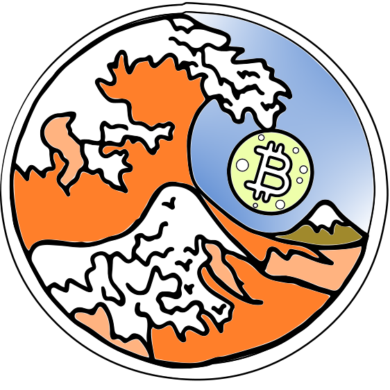

# Qui troverete alcune info su questo progetto e sul percorso che vogliamo percorrere assieme a VOI

Abbiamo scelto l'immagine di un onda riferendoci alla xilografia iconica [_"La grande onda di Kanagawa"_](https://it.wikipedia.org/wiki/La_grande_onda_di_Kanagawa) del maestro giapponese _Katsushika Hokusai_ in quanto esprime la forza del mare impetuoso in contrasto con la forza del magma ormai sopito all'interno del Monte Fuji, tsunami scatenato dalla Luna col simbolo di Bitcoin, polo attrattivo e nuovo paradigma economico, culturale, sociale e tecnologico.  

## Strumenti per la sovranità economica e digitale

Per mettere in pratica la nostra sovranità economica, questo gruppo non darà **_mai_** consigli di natura finanziaria.
Lo scopo di questo progetto è divulgare quanto più possibile strumenti, software, modalità operative, libere e open-source, legali e sicure per utilizzare al meglio **Bitcoin**.
***"Un sistema elettronico di scambio di moneta digitale da pari a pari"***, come introdotto dal White Paper di Satoshi Nakamoto e per farlo dobbiamo non solo conoscerlo, studiarlo, capirlo, ma anche utilizzarlo in maniera idonea utilizzando l’hardware e il software appropriato.

Cercheremo di raggruppare, condividere, scovare tutto il materiale più idoneo per lo scopo, senza farvi perdere tempo con cose poco utili o forvianti, **almeno a nostro parere…** 😅
(_chiunque, con un accont GitHub, potrà inviare segnalazoni, migliorie, errori, curiosità, approfondimenti per rendere questo spazio fruibile in maniera ottimale per tutti_)

### Come Studiare BITCOIN utilizzando sistemi LINUX in Sicurezza proteggendo anche la nostra Privacy?
Anche voi vi sarete domandeti dove informarsi correttamente su questi temi che oramai sempre più intrinsecamente si connettono in un unico workflow.
Dovremmo imparare a padroneggiarli almeno in parte per garantirci la possibilità di avere il controllo dei nostri dati, valori e strumenti.
Senza dover riscoprire il fuoco 🔥 , attingendo dal molto materiale di buona qualità presente nel web (sia in 🇮🇹 che in 🇬🇧/🇺🇸*), proponendo quasi un percorso con varie diramazioni per costruire una struttura di informazioni che vi faranno da base solida per il futuro che verrà.
Nel mondo arancione di **Bitcoin** si usa spesso la frase _"Scendere sempre più a fondo nella tana del Bianconiglio"_ riferendosi alla favola di Alice nel paese delle meraviglie e della sua discesa nella profondità quasi infinita della tana del Bianconiglio piena di porte aperte su mondi favolosi sempre diversi.  

*_non spaventatevi anche se non conoscete bene questa lingua, oramai ci somno sempre più strumenti per la traduzione istantanea sia video che testuale._

[Home](./TheOrangeWaveProject.github.io)

